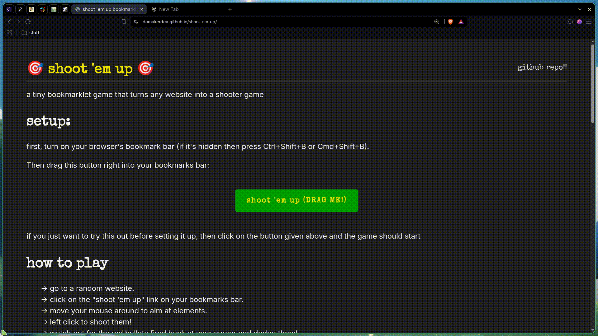

# 🎯 shoot 'em up *bookmarklet*

> turn any website into a shooter game!


---

## what is this?

**shoot 'em up** is a javascript bookmarklet, basically a script which turns any website into an arcade game when activated, and cab be saved as a bookmark in the bookmarks tab. In this game, the user has to destroy each and every element in the page using their cursor (clicking page elements destroys them) and be safe from enemy elements which shoot bullets at them too.. pew pewwww boom!

[SHOOT 'EM UP WEBSITE 👈](https://damakerdev.github.io/shoot-em-up/)

[click here to learn more about bookmarklet](https://en.wikipedia.org/wiki/Bookmarklet)


---

## 🚀 quick setup

1. display your browser's **Bookmarks Bar** (`Ctrl + Shift + B` or `Cmd + Shift + B`).
2. create a new bookmark in your bar with any name (e.g., `shoot 'em up`).
3. copy the following JavaScript snippet and paste it as the **URL / Location** of the bookmark:

```javascript
javascript:(function(){let script=document.createElement('script');script.src='https://damakerdev.github.io/shoot-em-up/shootemup.min.js';document.body.appendChild(script);})();
```
## how to play

* **Aim:** move your mouse pointer over page elements like a heading, button, etc.
* **Shoot:** left click to fire lasers and attack the elements.
* **Dodge:** some elements like button, image, etc shoot bullets, dodge them.


### HP values of elements

| HP | Target Tags |
| :--- | :--- |
| **100 HP** | `<h1>`, `<h2>`, `<h3>`, ``, `<button>` |
| **50 HP** | `<video>`, `<canvas>` |
| **20 HP** | `<p>`, `<span>`, `<a>`, `<li>`, `<input>` |


Made with ♥️ by [damakerdev](https://github.com/damakerdev)!
